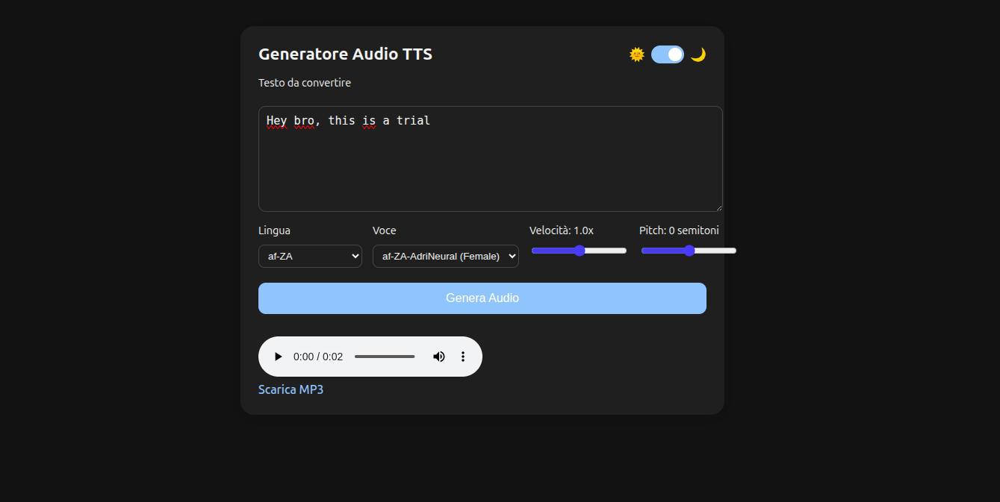
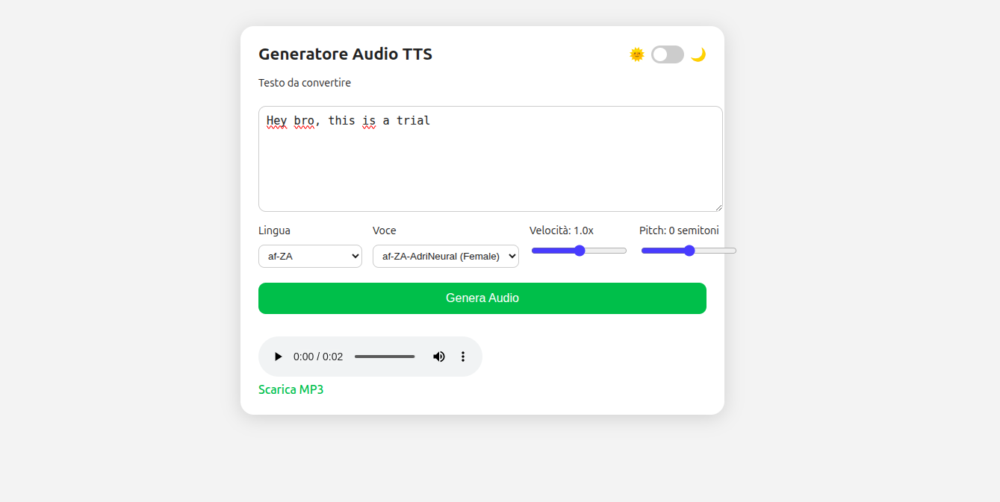

# TTS Web Application

## Overview




This project is a web-based Text-to-Speech (TTS) platform built with FastAPI and Edge-TTS. It provides a modern user interface allowing users to input text, select a voice among all available Microsoft Neural voices, adjust playback speed and pitch, and download or play the generated audio directly in the browser.

The system dynamically fetches the full list of available voices from Edge-TTS, ensuring automatic updates without maintaining a manual list. The frontend allows selection of language and voice combinations, supporting a fully multilingual experience.

## Features

* Web interface for text-to-speech generation
* Integration with Edge-TTS neural voices
* Dynamic voice list retrieval via API endpoint
* Selection of language and specific voice
* Adjustable speed and pitch parameters
* Dark and light theme support
* Audio playback directly in the browser
* Downloadable MP3 output

## Technologies Used

* **Backend** : FastAPI, Edge-TTS
* **Frontend** : HTML, CSS, JavaScript
* **Audio Output** : MP3 files generated server-side

## Project Structure

```
project/
│
├── main.py                 # FastAPI backend
├── requirements.txt        # Python dependencies
│
├── templates/
│   └── index.html          # Main frontend page
│
└── static/
    ├── style.css           # Styling and theme system
    └── script.js           # Client-side logic
```

## Backend Endpoints

### GET /

Returns the main web interface.

### GET /voices

Returns the full list of voices available from Edge-TTS, including:

* Voice name
* Short name
* Locale
* Gender
* Available speaking styles

### POST /generate

Generates an MP3 file based on:

* Text
* Selected voice
* Speed
* Pitch

The endpoint returns the binary audio file.

## Setup and Installation

### Requirements

* Python 3.9 or later (Python 3.13 fully supported)
* Virtual environment recommended

### Installation Steps

1. Clone this repository
2. Navigate into the project directory
3. Create and activate a virtual environment
4. Install dependencies:

```
pip install -r requirements.txt
```

5. Start the server:

```
uvicorn main:app --reload
```

6. Open the application in your browser:

```
http://localhost:8000
```

## Customization

The interface and interactions can be customized by modifying:

* `style.css` for appearance and themes
* `script.js` for voice loading, parameter handling, and UI behavior
* `index.html` for layout changes

## Acknowledgments

This project uses the Edge-TTS library, providing access to high-quality Microsoft Neural Text-To-Speech voices.
